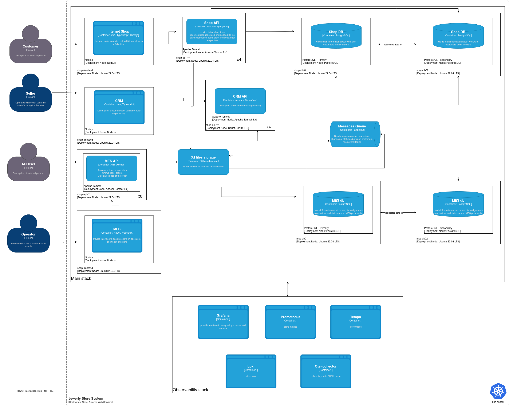

# Задание 1. Анализ, идентификация проблем и решений, планирование

## Диаграмма компонентов C4 (AS IS)

## 1. Существующие и потенциальные проблемные места системы

### Проблемы, которые озвучил бизнес

1. Клиенты жалуются менеджерам по продажам, что они не получили заказ и над их изделием работают уже несколько месяцев, хотя обещали закончить за три недели.
2. После открытия API для других продавцов, жалоб от клиентов на просроченные заказы стало ещё больше.
3. Жалобы от операторов: когда они заходят на первую страницу MES, система долго прогружается. Страница с дашбордов по заказам не отображается. Хотя есть пагинация и фильтрация.
4. Через месяц после открытия API компания потеряла уже несколько крупных контрактов из-за проблем с заказами.
5. Недовольство клиентов онлайн-магазина (B2C).
6. Периодические задержки релизов.

### Выделенные в ходе анализа

1. Компания теряет прибыль и клиентов: основная проблема, которая влияет на стратегию развития компании, имидж и ее будущее.

2. Нет понимания из-за чего возникают потери заказов после их оформления: команда разработки не понимает с чем связаны проблемы.

3. Bus-фактор на проекте MES (один разработчик C#): тимлид хоть и бывший разработчик C#, но его основная обязанность - это не разработка (не стоит его считать за разработчика C#). Если уйдет единственный разработчик, то работа над проектом MES может встать, а это ядро компании и ключевое преимущество. Новому сотруднику придется проходить онбординг и изучать код. С React есть аналогичная проблема.

4. Недостаточное покрытие автотестами: тестировщик вручную находит множество багов, это приводит к задержке релизов. Важно заметить, что ситуация с течением времени не меняется. Это говорит о том, что с процессом что-то не так.

5. Потентиальный отказ системы в будущем: так как нагрузка растет и жалоб становится все больше - есть риск полного отказа системы, когда вся работа встанет и системой будет невозможно пользоваться.

## 2. Инициативы, которые необходимы для устранения нежелательных ситуаций

1. **Оперативное решение проблем**, которые можно решить быстро и без существенных изменений в инфраструктуре. Предполагается сразу предпринять комплекс мер, чтобы не препятствовать работе компании и обеспечить надежность системы:
- **внедрение паттерна Backpressure** на стороне MES: так как MES - это компонент, который выполняет сложные CPU-bounded вычисления для анализа файлов и расчетов стоимости - он является узким местом системы. CRM может просто напросто "завалить" работой данный сервис, либо может скопиться большая очередь операций, которую не способен обработать MES. Предлагается внедрить подход Backpressure для снижения вероятности отказов. Таким образом мы сможем регулировать поток данных в MES из CRM, а главное - **обеспечим информирование производителя CRM сигналом обратной связи о том, что данные в избытке и нужно подождать**. Это позволит не терять заказы клиентов.

- **внедрение паттерна Circuit Breaker** на стороне CRM: когда CRM взаимодействует с MES она потенциально может "долбить" MES запросами. Если имеется такая проблема, то предлагается использовать паттерн прерывателя цепи и не делать запросов, если сервер не ответил за N-количество раз. Это позволит не расходовать ресурсы серверов.

- **внедрение паттерна Retry Policy** на стороне CRM или Message Broker: CRM не обязатально сразу после первой же ошибки от MES прекращать выполнение запросов. Можно попробовать выполнить повторные попытки с увеличивающимся интервалом времени. Это позволит не падать с ошибкой сразу же, а вернуть ответ когда сервер сможет быть готов.

- **внедрение кэширования** при работе с API заказов: веб-приложение читает данные напрямую из БД в процессе отображения данных по заказам. Чтобы не нагружать лишний раз базу данных и само приложение имеет смысл добавить слой кэширования в виде дополнительного компонента Redis.

- **анализ существующих проблем**, связанных с высокой задержкой API заказов: что является узким местом? Возможно, пагинация реализована некорректно: сначала читают всю таблицу в веб-приложение, а потом отдают фрагмент, когда можно читать из базы только фрагмент. Возможно, используются неоптимальные индексы в БД.

Субъективно, эти шаги не займут много времени в реализации и позволят быстро решить боли клиентов.

2. **Обеспечение надежной, мастшабируемой и отказоустойчивой архитектуры** с заделом на будущее. Шаги, выполненные в п.1, несомненно, могут быстро решить часть проблем, но первопричины остануться и поэтому следует сделать более объемные и масштабные изменения:

- **внедрение мониторинга, трассировок и логирования с алёртингом**: позволит узнавать ошибках в режиме реального времени, мониторить взаимодействие между компонентами и выявлять узкие места, получать уведомления о критических ситуациях в мессенджеры или электронную почту.

- **переход на k8s с helm**: текущее решение, в котором деплой происходит вручную предполагает, что сервисы развернуты на отдельных виртуальных серверах. DevOps-инженер после выхода релиза забирает архивы и "вручную" обновляет сервисы на каждом отдельном сервере подменяя файлы сборок. Это очень неудобно, расходует много времени, ресурсов и несет в себе риски человеческого фактора (может быть допущена ошибка). Переход на k8s с helm позволит:
    - значительно ускорить доставку обновлений (CD)
    - снизить риск допущения ошибок разворачивания
    - добавить возможность автоматического масштабирования
    - обеспечить высокую надежность и отказоустойчивость.

Предполагается, что в рамках этого пункта также закроется вопрос масштабирования приложений.

3. **Решение проблем с MES и системы в целом** в долгосрочной перспективе: чтобы понимать узкие места системы следует провести комплекс мер:

- **нагрузочное тестирование** с выявлением узких мест системы: позволит понять, какой компонент является проблемным. Также немаловажным является тот факт, что после соответствующих исправлений можно запустить тесты вновь и убедиться, что картина изменилась в лучшую сторону, а также прогонять тесты перед выпуском релиза (чтобы видеть, что не стало хуже).

- **исправление обнаруженных проблем**: предполагается проведение профилирования (CPU, RAM) и отладки на стороне MES с последующими оптимизациями производительности. Это подразумевает исправления на уровне кода.

3. **Решение проблем с задержками выхода релизов**: текущий охват unit-тестов не позволяет выявить баги. Единственный тестировщик в ходе ручного тестирования тест-кейсов их находит. Для повышения качества предлагается:

- **внедрить практику интеграционного тестирования**: подразумевается написании автотестов, которые охватывают несколько компонентов. Начать работу над этим могут сами разработчики, с последующим подключением тестировщика, который имеет желание и мотивацию овладеть знаниями автотестов. Плюс добавление в команду нового тестировщика ускорит процесс в будущем.

4. **Расширение команды**: предлагается расширить штат, т.к. компания растет, с этим также возрастают: нагрузка, требования бизнеса к функциональности, требования к надежности и т.д.:

- **1 frontend-разработчик** (с упором на React) на сервис MES уровня Middle или выше

- **1 backend-разработчик** (C#) на сервис MES - Middle или выше

- **1 QA-инженер** (с опытом написании автотестов) - Middle или выше

- **возможное деление команды на две**: одна занимается CRM, другая MES

## 3. Целевая архитектура через полгода

Через полгода я вижу архитектуру, способную масштабироваться, отвечать требованию надежности и отказоустойчивости. Все озвученные бизнесом проблемы закрыты. По пунктам:
- Используем Kubernetes для прод/релиз-окружений. Minikube для dev.
- CI/CD автоматизирован полностью до продакшена.
- Автотесты покрывают критический путь B2B и B2C.
- MES масштабируется горизонтально, загруженные расчёты выносятся в воркеры.
- Появилась команда поддержки MES (React + C#).
- Вся система покрыта Observability-стеком (логирование, трассировка, метрики).

## 4. Три наиболее важных пункта из списка инициатив в ближайшие полгода

0. Сразу же начать найм (это можно делать параллельно с другими пунктами) п.4
1. Выполнить инициативу п.1 с оперативым решением проблем
2. Выполнить инициативу п.2 с акцентом на переход в k8s
3. Выполнить инициативу п.3 с интеграционным тестированием